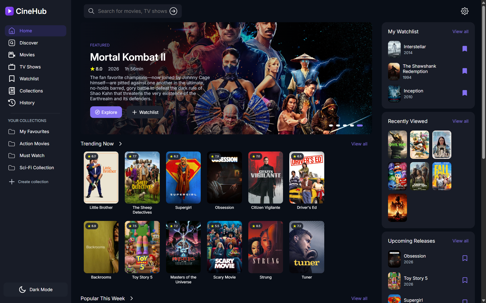

# CineHub



CineHub — современный веб-интерфейс для поиска и просмотра информации о фильмах и сериалах, вдохновлённый стриминговыми платформами.

Проект создан для практики frontend-разработки, изучения адаптивной вёрстки, компонентного подхода и организации SCSS-архитектуры.

---

## Возможности

- Адаптивный интерфейс
- Тёмная/светлая тема
- Компонентная структура
- Модульная SCSS-архитектура
- Использование методологии БЭМ
- Использование TMDb API
- Hash-роутинг

---

## Технологии

- HTML5
- SCSS
- Модульный JavaScript

---

## Цели проекта

- Практика современной frontend-разработки
- Изучение архитектуры SCSS
- Работа с компонентным подходом
- Интеграция API
- Разработка масштабируемого интерфейса

---

## Планы по развитию

- Поиск фильмов и сериалов
- Страницы фильмов
- Система избранного
- Улучшение UX/UI

---

## Запуск проекта

Пользователям из России требуется включение VPN. Возможность использовать проект без него будет разработана

Просто откройте `index.html` в браузере.

```bash
git clone https://github.com/Davo-web/CineHub
```

---

## Статус проекта

Проект находится в активной разработке.